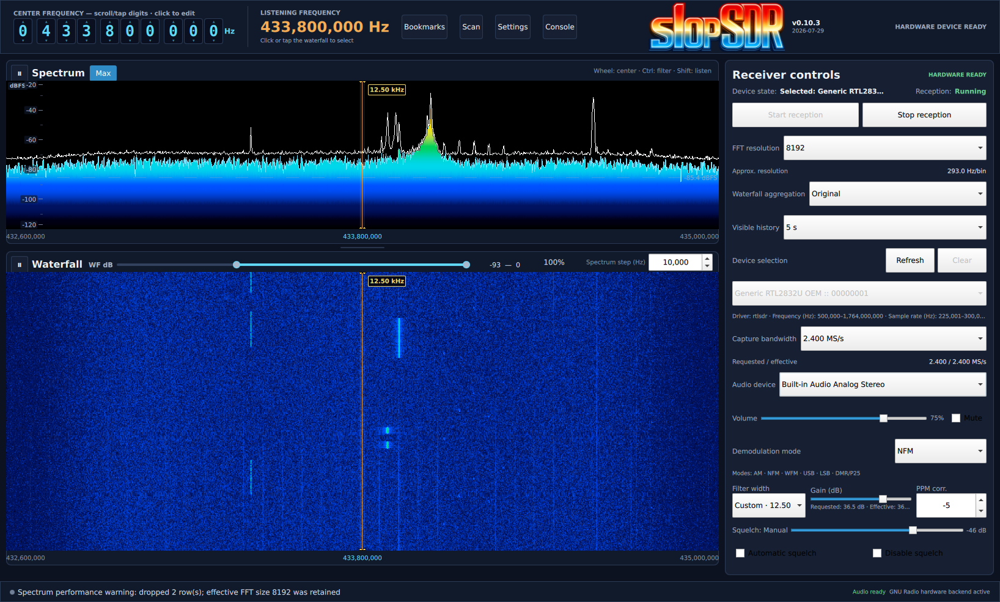

# slopSDR

slopSDR is a desktop software-defined-radio receiver for exploring, tuning,
demodulating, and visualizing signals. Its Qt Quick interface, radio domain,
GNU Radio DSP, SoapySDR device access, and platform services remain separate.



## Designed for everyday use

slopSDR uses a responsive Qt 6 desktop interface with synchronized Spectrum
and Waterfall views. Each display has its own pause control, while zooming and
horizontal viewport panning move the visible data without retuning the
receiver. The center-frequency digits can be edited directly, and the Scan
pane supports Current passband and Wide range scanning with persistent named
presets.

The Spectrum header includes independent persisted **Max** and **AVG**
controls. AVG applies timestamp-based smoothing directly to normalized values
on the displayed dBFS axis, only to the live spectrum trace; its minimum is an
exact bypass and it never changes waterfall data.

The Bookmarks pane supports updating bookmarks, saved squelch, and scanning
bookmarks in their saved order. Receiver Controls keep a stable layout with
reduced flicker, while configurable Waterfall aggregation and persistent
receiver and scanner settings retain the choices that matter between sessions.
Use the always-visible **Record audio** control to save final received audio as
48 kHz 16-bit stereo WAV before speaker volume and mute; recordings continue
across scanner and manual retunes. Choose the persistent recordings folder in
**Settings**. Optional **Skip quiet parts** arms a recording until the receiver
squelch opens, then saves bounded pre-roll and a configurable tail in the same
WAV while omitting longer quiet gaps.
When **Record scanner activity** is enabled, scanner squelch activity is saved
as separate filtered-audio WAV clips with JSON sidecars describing the target,
mode, scanner source, and clip duration.
Analog reception is supported in AM, NFM, WFM, USB, and LSB. DMR/P25 remains
experimental and requires a separately installed DSD-FME executable; it is not
the focus of this stable release.

## Center-frequency selector

The center frequency is the center of the hardware capture window. The
listening frequency is the demodulated frequency selected inside that window.
Display panning moves only the visible Spectrum/Waterfall viewport; it does
not change either receiver frequency.

The decimal selector supports these direct interactions:

* Hover a digit and press `0`–`9` to replace that digit and tune immediately.
* Hover a digit and press Up or Down to adjust that digit outside edit mode.
* Right-click a digit to zero it and every digit to its right.
* Left-click a digit to begin sequential editing. Entered digits replace from
  the selected position and advance to the right.
* Left-click within the editable span to move back for corrections.
* Press Enter to accept the pending frequency, or Escape to cancel and restore
  the original frequency.

When the scanner owns tuning, these center-frequency interactions are disabled
until scanning stops.

## Platform and capabilities

slopSDR targets Debian-family desktop Linux. It is developed and hardware-tested
on Devuan; Debian and Ubuntu package names below are installation references,
not a claim that every Debian-family distribution is tested.

The application discovers and selects SDR hardware through SoapySDR, receives
with GNU Radio, renders spectrum and waterfall displays, provides 48 kHz audio,
stores settings and bookmarks, and includes PPM calibration and a session
console. Its five built-in analog demodulation modes are AM, NFM, WFM, USB, and
LSB. **DMR/P25** is experimental: it is a separate digital-decoder mode that
sends discriminator audio to a separately installed DSD-FME executable.
Decoding reliability may vary, and FEC errors or audio underruns may occur.
Encrypted traffic is not decoded. The Scan pane supports fixed-center
**Current passband** scans and hardware-retuning **Wide range** scans. Wide
range plans the fewest safe capture blocks for the active filter, retunes only
between blocks, and owns center and listening-frequency tuning until Stop.
Named Scan-pane presets store ordered scanner configurations, including scan
type, without storing runtime scan state or position.
The Bookmarks pane scans checked bookmarks in saved order with independently
persisted dwell and resume-delay settings, applying each bookmark's saved
receiver settings.

RTL-SDR Blog V4 handling is documented in [device access](docs/DEVICE_ACCESS.md).
Hardware is never opened and reception never starts until you explicitly press
**Start**.

## Requirements

Build and linked runtime dependencies are supplied by the distribution package
manager, normally APT on the documented Debian-family systems. slopSDR does not
download, build, vendor, install, or update them.

The desktop hardware build requires CMake 3.22 or later, a C++20 compiler,
Ninja, Qt 6.2 or later (Core, Gui, Multimedia, QML, Quick, Quick Controls 2,
Quick Dialogs 2, and Test), GNU Radio (analog, blocks, FFT, filter, and runtime
components), and SoapySDR. On Debian-family systems with the package names used
by Debian and Ubuntu, install:

```sh
sudo apt update
sudo apt install build-essential cmake ninja-build \
    qt6-base-dev qt6-declarative-dev qt6-multimedia-dev \
    qml6-module-qtqml-workerscript qml6-module-qtquick \
    qml6-module-qtquick-controls qml6-module-qtquick-dialogs \
    qml6-module-qtquick-layouts qml6-module-qtquick-window \
    gnuradio-dev libsoapysdr-dev soapysdr-tools
```

Install the appropriate SoapySDR module and driver for your receiver. For
RTL-SDR, Debian currently uses `soapysdr0.8-module-rtlsdr` and `rtl-sdr`; an
Ubuntu release may expose the module as `soapysdr-module-rtlsdr`.

### Optional DSD-FME

DMR/P25 support is experimental and requires a compatible, separately installed
DSD-FME executable; analog reception does not. DSD-FME may be installed outside
APT, including under `/usr/local/bin`. In slopSDR, open **Settings**, set
**DSD-FME binary** to the executable path, and select **DMR/P25** while
receiving. Decoding reliability may vary, and FEC errors or audio underruns may
occur. Encrypted traffic is not decoded. slopSDR does not install, discover, or
update DSD-FME.

## Build and run

Configure and build the normal desktop hardware application from the repository
root:

```sh
cmake --preset desktop-app-release
cmake --build build/desktop-app-release -j2
```

`desktop-app-release` is the normal user build. It uses the release hardware
configuration and does not compile the test suite.

Run the application directly from the build tree; installation or packaging is
not required for normal use:

```sh
./build/desktop-app-release/slopsdr
```

At startup, let the application discover devices, select the intended SDR, and
press **Start** to open it and begin reception. Choose an analog mode and tune
normally. Configure DSD-FME only when using DMR/P25. Use `--mock` for deliberate
hardware-free runs. [Building](docs/BUILDING.md) documents debug, mock,
hardware-test, diagnostic, and install commands.

## Development and testing

Use the separate release-oriented maintainer build when compiling and running
the test suite:

```sh
cmake --preset desktop-tests
cmake --build build/desktop-tests -j2
ctest --preset desktop-tests
./tools/test-gui-headless.sh
```

The headless GUI script uses `build/desktop-tests` by default and accepts an
explicit build directory override when needed.

## GUI quick controls

The spectrum and waterfall share one frequency viewport. Wheel events over
either display are consumed by slopSDR; they do not scroll the waterfall's
history.

| Input | Result |
| --- | --- |
| Wheel over spectrum (no modifier) | Tunes the center and listening frequencies together by the configured spectrum tuning step; the shared viewport keeps its zoom/span and recenters around the new center. Rapid consecutive events use application-level scroll acceleration for this operation; after scrolling pauses, the rate returns to fine control. This is separate from operating-system mouse acceleration. |
| Wheel over waterfall (no modifier) | Zooms the shared frequency viewport in or out, anchored on the listening/tuned frequency rather than the pointer; center frequency, listening frequency, and filter width do not change. |
| Horizontal scrollbar below waterfall | Pans the shared zoomed spectrum/waterfall viewport across the usable captured span without tuning the receiver or changing scanner state. |
| `Ctrl`+wheel over either display | Widens (`up`) or narrows (`down`) the active demodulation filter by its mode-specific step, within its limits; frequencies and viewport are unchanged. |
| `Shift`+wheel over either display | Moves only the listening frequency by the configured spectrum tuning step (`up` higher, `down` lower). The center and filter width stay unchanged; when zoomed, the shared viewport recenters on the new listening frequency (clamped to capture coverage). |
| `Ctrl`+`Shift`+wheel (with or without `Alt`) | `Ctrl` takes priority: adjusts filter width; `Shift` does not also tune. `Alt` alone does not change the selected action. |

The waterfall's primary click selects the listening frequency represented by
that horizontal position. No drag or double-click is needed for normal tuning.
The compact spectrum **AVG** slider runs from off at its minimum to strong
smoothing at its maximum. It remains independent of **Max**, spectrum pause,
and every waterfall control.
The persisted visible-history selector includes fast 1-second and 2.5-second
views. New waterfall data uses a 60 Hz live cadence with real FFT-row
retention, so those history choices change scrolling scale without adding a
one- or 2.5-second startup delay. If Waterfall is paused during any scan, its
image is blacked until resumed so stale rows cannot represent a newly scanned
frequency.
For the complete interaction rules, see [GUI requirements](docs/GUI_REQUIREMENTS.md),
the [frequency-control guide](docs/FREQUENCY_CONTROL.md), and the
[user guide](docs/USER_GUIDE.md).

## Configuration

`XDG_CONFIG_HOME` sets the configuration base; when it is unset, Qt uses
`$HOME/.config`. slopSDR stores its persistent files at:

```text
${XDG_CONFIG_HOME:-$HOME/.config}/slopSDR/slopSDR.conf
${XDG_CONFIG_HOME:-$HOME/.config}/slopSDR/bookmarks.json
```

`slopSDR.conf` contains QSettings-managed application settings under the
`slopSDR` organization and application name, including the DSD-FME executable
path, recordings folder, and recording quiet-skip settings. `bookmarks.json` contains bookmark groups and bookmark data. Use the GUI
to change these settings rather than editing either file while slopSDR is
running. Renaming or removing either file resets or isolates that part of the
configuration; retain a copy first if you need to preserve it.

## Documentation

* [User guide](docs/USER_GUIDE.md)
* [Device access and SDR behavior](docs/DEVICE_ACCESS.md)
* [Audio and DSD-FME transport](docs/AUDIO.md)
* [Troubleshooting](docs/TROUBLESHOOTING.md)
* [Historical validation observations](docs/VALIDATION.md)

## Project status, licensing, and forks

slopSDR is a completely vibecoded personal project, developed through
AI-assisted coding tools under the maintainer's direction. It is published as-is
without a support, maintenance, compatibility, or development-roadmap promise.

slopSDR and its original repository contents are licensed under the
[GNU Affero General Public License version 3 only](LICENSE) (`AGPL-3.0-only`).

This upstream repository does not accept contributions. Forks may be maintained,
modified, and redistributed independently under the AGPL; see
[CONTRIBUTING.md](CONTRIBUTING.md).

## Repository layout

```text
.
|-- CMakeLists.txt       Top-level build definition
|-- CMakePresets.json    Desktop build presets
|-- CONTRIBUTING.md      Upstream contribution policy
|-- LICENSE              Project license
|-- README.md            Project overview
|-- app/                 Application entry point and application model
|-- cmake/               Shared CMake modules and generated-header inputs
|-- devices/             SDR device adapters
|-- docs/                Project documentation
|-- dsp/                 DSP backend implementation
|-- gui/                 Qt GUI implementation
|-- platform/            Platform and persistence services
|-- qml/                 QML presentation files
|-- radio/               Radio-domain implementation
|-- tests/               Automated tests
`-- tools/               Development and test helpers
```
